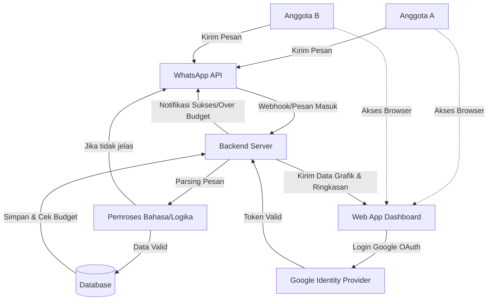
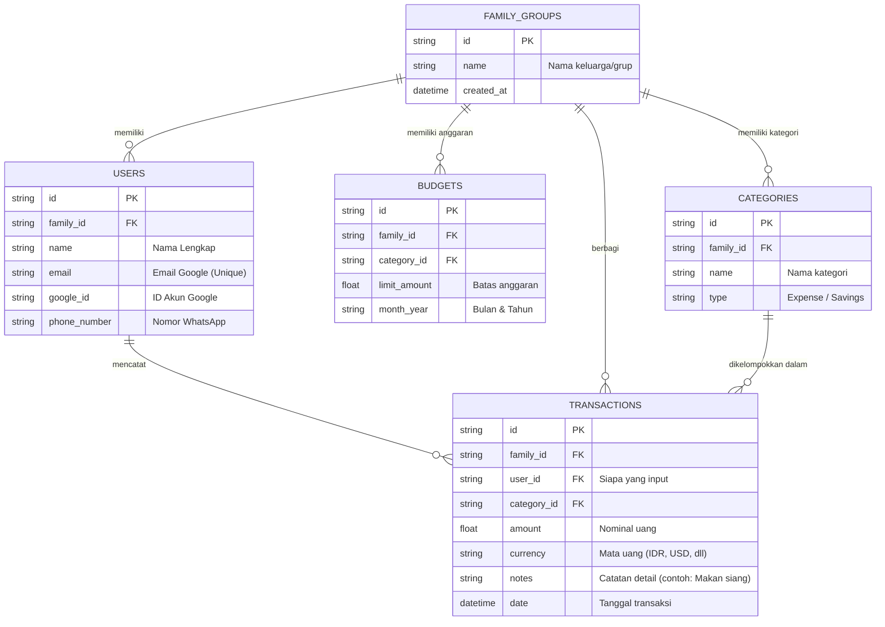

# PRD — Project Requirements Document

## 1. Overview
Anggota keluarga seringkali kesulitan melacak pengeluaran bersama secara konsisten. Mencatat secara manual di aplikasi keuangan dirasa merepotkan, terutama saat sedang bepergian atau sibuk. **fINAn-SHAl** hadir sebagai sistem pelacakan keuangan pribadi dan keluarga berbasis **Web-App** yang dirancang khusus untuk **multiple pengguna** (misalnya suami, istri, dan anak atau anggota keluarga lainnya). 

Aplikasi ini mengatasi masalah tersebut dengan memungkinkan pengguna mencatat pengeluaran semudah mengirim pesan WhatsApp. Data yang masuk akan otomatis direkap ke dalam satu dasbor bersama untuk memberikan visibilitas keuangan yang transparan, merencanakan tujuan keuangan (cicilan/tabungan), dan mempermudah berbagi tagihan (split bill) antar anggota keluarga secara praktis. **Catatan Penting:** Aplikasi ini sepenuhnya berbasis web yang diakses melalui browser dan **tidak akan dirilis melalui App Store atau Google Play Store** pada fase awal pengembangan.

## 2. Requirements
- **Target Pengguna:** Anggota keluarga (multiple users) yang berbagi satu dasbor keuangan namun memiliki akses input dari nomor WhatsApp dan akun Google masing-masing.
- **Platform:** 
  - **Web-App:** Diakses melalui browser (Chrome, Safari, dll) pada Mobile & Desktop. Tidak memerlukan instalasi aplikasi native.
  - **WhatsApp:** Digunakan untuk pencatatan harian via WhatsApp Bot.
  - **Domain:** Saat ini menggunakan domain sementara (subdomain penyedia hosting). Pembelian domain kustom (contoh: financshal.com) direncanakan pada fase pengembangan selanjutnya.
- **Keamanan:** Menggunakan **Google OAuth (Login Email Google)** untuk mengakses Dasbor keuangan. Tidak ada PIN manual.
- **Mata Uang:** Mendukung multi-mata uang (semua mata uang) untuk kebutuhan liburan atau belanja internasional.
- **Notifikasi:** Peringatan otomatis via WhatsApp jika pengeluaran mendekati atau melebihi batas anggaran (Budget).

## 3. Core Features
- **Autentikasi Google OAuth:**
  - Pengguna login ke Dasbor menggunakan akun Google mereka untuk keamanan dan kemudahan akses.
  - Sistem mengenali pengguna berdasarkan email Google yang terverifikasi.
- **Pencatatan Pengeluaran via WhatsApp (WA Bot):**
  - Pengguna dapat mengetik secara terstruktur (contoh: "Makan 45000 food") atau bahasa sehari-hari (contoh: "Habis 45rb buat makan siang tadi").
  - Bot akan meminta klarifikasi jika pesan tidak dipahami.
  - Balasan konfirmasi sukses dari bot untuk setiap catatan yang berhasil disimpan.
  - Identitas pengirim WhatsApp dipetakan ke akun Google pengguna yang terdaftar.
- **Dasbor Keuangan Bersama (Shared Dashboard):**
  - Menampilkan ringkasan harian dan bulanan dengan visualisasi **Grafik Garis (Line Chart)** untuk melihat tren pengeluaran.
  - Menampilkan rincian kontribusi pengeluaran masing-masing anggota keluarga.
- **Manajemen Anggota Keluarga:**
  - Fitur untuk mengundang anggota keluarga baru (via email atau link undangan) untuk bergabung ke dalam grup keluarga yang sama.
  - Anggota yang diundang dapat melihat dasbor, transaksi, dan perencanaan anggaran secara real-time.
- **Kategori Pengeluaran Dinamis:**
  - Kategori bawaan: *Household* (Rumah tangga), *Travel & Trips* (Perjalanan), *Entertainment* (Hiburan), *Goods & Shopping* (Belanja), *Financial Commitments* (Cicilan/Tagihan). Pengguna dapat menambah kategori baru.
- **Perencanaan Keuangan (Goals & Budgets):**
  - Fitur untuk menetapkan target tabungan bersama atau cicilan bulanan.
- **BCA Deep Link untuk Cost-Sharing:**
  - Pembuatan tautan (link) transfer BCA secara otomatis untuk mempermudah penggantian uang (split bill) antar anggota keluarga, tanpa perlu integrasi merchant API yang rumit.
- **Ekspor Data:**
  - Pengguna dapat mengunduh laporan keuangan dalam format Excel atau CSV.

## 4. User Flow
**Skenario A: Mencatat Pengeluaran via WhatsApp**
1. Pengguna (Anggota Keluarga) mengirim pesan pengeluaran ke nomor WhatsApp fINAn-SHAl.
2. Sistem menganalisis pesan dan mencocokkan nomor WhatsApp dengan pengguna yang terdaftar di database. (Jika pesan kurang jelas, bot akan membalas: *"Maaf, bisa perjelas nominal dan kategorinya?"*)
3. Sistem menyimpan jumlah, kategori, dan tanggal pengeluaran, lalu memberi label "Siapa yang mencatat".
4. Bot membalas dengan tanda terima/konfirmasi singkat.
5. (Opsional) Jika pengeluaran membuat kategori tertentu melebihi budget, bot mengirim pesan peringatan tambahan.

**Skenario B: Memantau, Analisis, dan Manajemen Anggota di Dasbor**
1. Pengguna membuka URL aplikasi fINAn-SHAl di browser (HP/Laptop).
2. Pengguna melakukan **Login menggunakan Google Account**.
3. Pengguna melihat Grafik Garis (Line Chart) tren pengeluaran bulan ini dan rincian siapa yang membayar apa.
4. Pengguna mengeklik tombol "Undang Anggota", memasukkan email keluarga, dan mengirim undangan.
5. Pengguna mengeklik tombol "Tagih Anggota", sistem menghasilkan link transfer BCA (BCA Deep link) yang bisa di-copy ke WhatsApp.
6. Pengguna mengeklik tombol "Export" untuk mengunduh laporan CSV/Excel.

## 5. Architecture
Sistem terdiri dari antarmuka Web untuk Dasbor, integrasi layanan pihak ketiga untuk WhatsApp Bot, penyedia autentikasi Google, dan backend yang memproses bahasa alami (NLP) ke dalam format data keuangan.

## 6. Database Schema
Aplikasi ini menggunakan basis data relasional sederhana untuk mengelola grup keluarga, pengguna (anggota keluarga), kategori, transaksi, dan anggaran.

**Detail Tabel:**
1. **FAMILY_GROUPS:** Menyimpan entitas keluarga/grup. Menggantikan tabel `COUPLE` untuk mendukung lebih dari 2 anggota.
2. **USERS:** Menyimpan data individu anggota keluarga yang terhubung ke satu `FAMILY_GROUPS`. Identifikasi utama menggunakan `email` dan `google_id` untuk login, serta `phone_number` untuk integrasi WhatsApp.
3. **CATEGORIES:** Menyimpan daftar kategori (bawaan dan kustom) milik grup keluarga tersebut.
4. **TRANSACTIONS:** Menyimpan semua mutasi pengeluaran. Termasuk nominal, jenis mata uang, siapa yang berbelanja/mencatat, dan tanggalnya.
5. **BUDGETS:** Menyimpan batas anggaran bulanan per kategori untuk memicu notifikasi WhatsApp jika pengeluaran melebihi batas.

## 7. Tech Stack
Berikut adalah rekomendasi teknologi untuk membangun fINAn-SHAl agar cepat, stabil, dan modern dengan fokus pada infrastruktur Web-App dan keamanan autentikasi:

- **Frontend:** Next.js (React Framework) untuk performa web yang cepat dan responsif.
- **Styling & UI:** Tailwind CSS dipadukan dengan shadcn/ui untuk tampilan yang bersih, responsif, dan mudah disesuaikan. *Recharts* atau *Chart.js* untuk visualisasi Grafik Garis.
- **Backend:** Next.js API Routes (Serverless) untuk menangani logika aplikasi dan Webhook dari WhatsApp.
- **Authentication:** **Auth.js (NextAuth)** untuk menangani **Google OAuth**. Memastikan keamanan login tanpa perlu manajemen password manual.
- **WhatsApp Integration:** WhatsApp Cloud API (resmi dari Meta) atau layanan seperti Twilio/Wablas untuk mengirim dan menerima pesan.
- **Database:** SQLite (mudah, cepat, tanpa biaya server tinggi untuk awal) dikelola menggunakan Drizzle ORM agar interaksi dengan database terjamin keamanannya (*type-safe*).
- **Deployment & Domain:**
  - **Hosting:** Vercel (untuk Frontend & API backend) karena integrasi yang sangat mulus dengan ekosistem Next.js.
  - **Domain Strategy:** Pada fase awal menggunakan subdomain gratis dari penyedia hosting. Pembelian domain kustom (misalnya `.com` atau `.id`) direncanakan pada fase pengembangan selanjutnya untuk branding dan kepercayaan pengguna yang lebih baik.